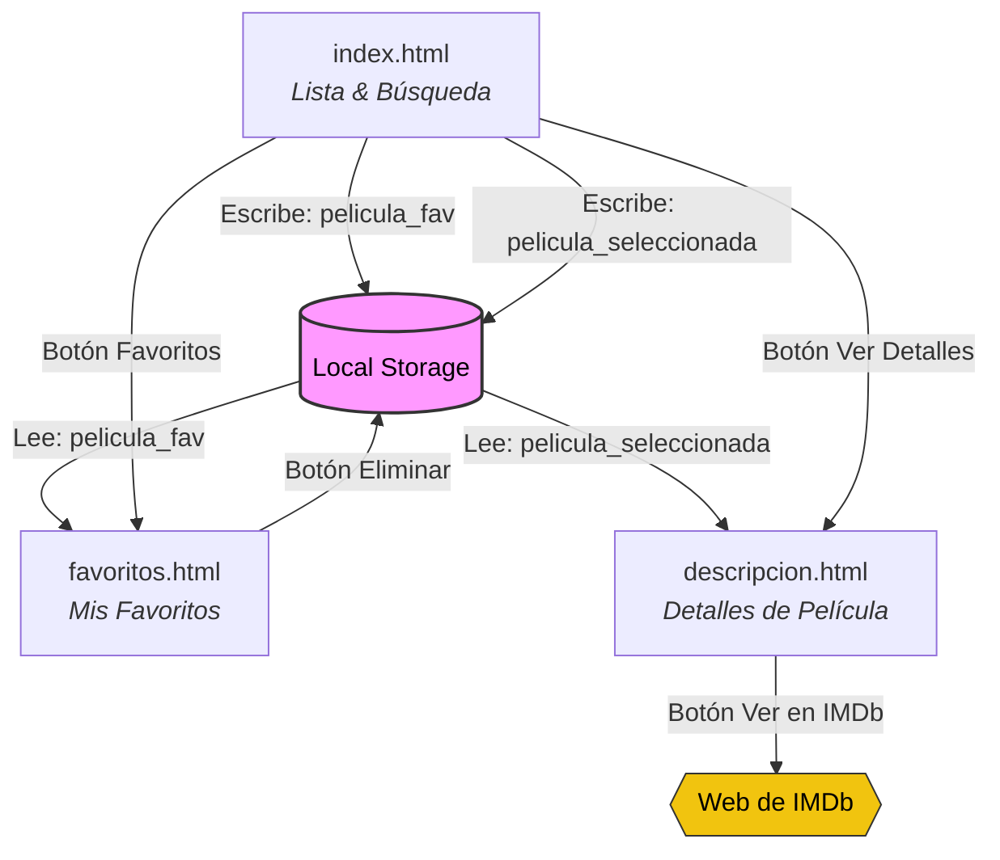

# Cine TV

## Descripcion

**Cine TV** es una plataforma web desarrollada para ver películas y series de forma rápida y sencilla. Es un proyecto de aceso gratuito, se enfoca en una interfaz limpia, responsiva y con una experiencia de usuario inspirada en las grandes plataformas de contenido audiovisual.

## Funcionalidades Core (MVP) 

- Página principal de peliculas
- Página de descripción de una película sen concreto
- Herramienta de búsqueda de peliculas según el título
- Listado de películas favoritas

## Estructura del Prototipo

- **index.html:** Página principal con el listado de películas y con la herramienta de búsqueda. Cuando se realiza la búsqueda, se actualiza el contenido de la página en vez de llevarnos a otra diferente. Cada película aparece con dos botones, uno para añadir a favoritos y otro para ver la descripción y más detalles. 
- **favorito.html:** Página con el listado de películas favoritas con la opción de eliminarlas del listado de favoritos.
- **descripcion.html:** Página con la descripción y los detalles de una película individual. También aparece un botón con el que ir a consultarla y verla a IMDb.

<center>



</center>

## Tecnologías utilizadas
![ReactCompiler]
![Packege.json]


## Enfoque técnico

El desarrollo del prototipo se ha planteado siguiendo los siguientes requerimientos técnicos del proyecto:

- Programación orientada a objetos (POO).
- Manipulación del DOM.
- Uso de `addEventListener` para escuchar y reaccionar a eventos en el DOM.
- Consumo de API mediante el método `fetch`.
- Sistema de búsqueda.
- Guardar preferencias (favoritos) en `localStorage`.
- Visualización de datos en un listado (resultado de búsqueda o favoritos).

## Árbol de archivos
```text
cine-tv/
├── node_modules/             # Dependencias del proyecto instaladas por npm
├── public/                   # Archivos estáticos globales (iconos, etc.)
├── src/                      # Código fuente de la aplicación React
│   ├── assets/               # Recursos estáticos locales (imágenes, logos)
│   ├── components/           # Componentes de UI reutilizables (Header, Navbar, MovieCard, Footer)
│   ├── pages/                # Vistas principales de la app (Inicio, Favoritos, Descripcion)
│   ├── services/             # Lógica de conexiones externas (Llamadas a la API de OMDb)
│   ├── App.jsx               # Componente raíz con el enrutador y layout principal
│   ├── index.css             # Estilos CSS unificados de toda la aplicación
│   └── main.jsx              # Punto de entrada de React (conecta con el HTML)
├── .gitignore                # Archivos y carpetas excluidos en Git (como node_modules)
├── eslint.config.js          # Configuración del linter para la calidad del código
├── index.html                # Archivo HTML base donde se monta la app de React
├── package-lock.json         # Historial exacto de las versiones instaladas
├── package.json              # Configuración del proyecto y scripts de npm (dev, build, lint)
├── README.md                 # Documentación del proyecto
└── vite.config.js            # Configuración del empaquetador Vite
```

## Hecho con React ----  Autores

- [Ermidio](https://github.com/Edy1110)

